<div align="center">

<!-- Animated Header -->


<!-- Animated Typing -->
<a href="https://git.io/typing-svg"></a>

<br/><br/>

<!-- Tech Stack Badges -->
<p>
  
  
  
  
</p>

<!-- Status Badges -->
<p>
  
  
  
  
</p>

<!-- Live Demo Button -->
<p>
  <a href="https://voltyks-angular.vercel.app">
    
  </a>
</p>

---

<!-- Navigation -->
<p>
  <a href="#-overview">Overview</a> •
  <a href="#-features">Features</a> •
  <a href="#-quick-start">Quick Start</a> •
  <a href="#-architecture">Architecture</a> •
  <a href="#-tech-stack">Tech Stack</a> •
  <a href="#-screenshots">Screenshots</a>
</p>

</div>

<br/>

<!-- Overview Section -->
##  Overview


**Voltyks Admin Panel** is a cutting-edge management dashboard designed for the Voltyks EV charging platform.

Built with the latest **Angular 20** featuring:
- ✨ Standalone Components
- 🔄 New Control Flow (`@if`, `@for`, `@switch`)
- ⚡ Signal-based Reactivity
- 🎯 Lazy Loading Optimization

The dashboard provides comprehensive tools for managing users, chargers, vehicles, transactions, and platform content with a beautiful RTL-ready Arabic interface.

<br clear="right"/>

---

<!-- Features Section -->
##  Features

<table>
<tr>
<td width="50%" valign="top">

### 📊 Analytics Dashboard
```diff
+ Real-time statistics
+ Interactive Chart.js graphs
+ Quick navigation cards
+ Activity monitoring
```

### 👥 User Management
```diff
+ Complete CRUD operations
+ Wallet & balance tracking
+ Chargers per user view
+ Account status control
```

### 🔌 Charger Management
```diff
+ Registration & tracking
+ Location management
+ Availability status
+ Usage analytics
```

</td>
<td width="50%" valign="top">

### 🚗 Vehicle Management
```diff
+ Vehicle registration
+ Brand/Model linking
+ User assignments
+ Fleet overview
```

### 💳 Transactions
```diff
+ Process tracking
+ Detailed view panel
+ Status management
+ Financial reports
```

### 📝 Content Management
```diff
+ Terms & Conditions (JSON)
+ Protocol editor
+ Multi-language (AR/EN)
+ Dynamic updates
```

</td>
</tr>
</table>

### 🎯 Additional Modules

<div align="center">

|  Brands |  Fees |  Reports |  Complaints |
|:---:|:---:|:---:|:---:|
| Brand & Model Management | Platform Fee Configuration | Generate & Export Reports | User Complaints System |

</div>

---

<!-- Quick Start Section -->
##  Quick Start

### Prerequisites

<table>
<tr>
<td>

```
📦 Node.js    18.x+
📦 npm        9.x+
📦 Angular    20.x
```

</td>
<td>

```bash
# Verify installations
node --version
npm --version
ng version
```

</td>
</tr>
</table>

### ⚡ Installation

```bash
# 1️⃣ Clone the repository
git clone https://github.com/AhmedSalem104/Voltyks_Angular.git

# 2️⃣ Navigate to project
cd Voltyks_Angular/voltyks-admin

# 3️⃣ Install dependencies
npm install

# 4️⃣ Start development server
npm start

# 🎉 Open http://localhost:4200
```

### 📜 Available Scripts

| Command | Description |
|:--------|:------------|
| `npm start` | 🚀 Start dev server at `localhost:4200` |
| `npm run build` | 📦 Production build |
| `npm run build:github` | 🌐 Build for GitHub Pages |
| `npm test` | 🧪 Run unit tests |

---

<!-- Architecture Section -->
##  Architecture

```
📁 voltyks-admin/
├── 📂 src/
│   ├── 📂 app/
│   │   ├── 🔷 core/                    # Core functionality
│   │   │   ├── 🛡️ guards/              # Route guards
│   │   │   ├── 🔄 interceptors/        # HTTP interceptors
│   │   │   ├── 📋 models/              # TypeScript DTOs
│   │   │   └── ⚙️ services/            # API services
│   │   │
│   │   ├── 🎨 features/                # Feature modules
│   │   │   ├── 🔐 auth/                # Authentication
│   │   │   ├── 📊 dashboard/           # Main dashboard
│   │   │   ├── 👥 users/               # User management
│   │   │   ├── 🔌 chargers/            # Chargers
│   │   │   ├── 🚗 vehicles/            # Vehicles
│   │   │   ├── 💳 processes/           # Transactions
│   │   │   ├── 🏷️ brands/              # Brands
│   │   │   ├── 🚙 models/              # Models
│   │   │   ├── 💰 fees/                # Fees
│   │   │   ├── 📄 terms/               # Terms
│   │   │   ├── 📋 protocol/            # Protocol
│   │   │   ├── 📈 reports/             # Reports
│   │   │   └── 📢 complaints/          # Complaints
│   │   │
│   │   ├── 🖼️ layout/                  # Layout components
│   │   └── 🔧 shared/                  # Shared components
│   │
│   └── 🌍 environments/                # Config files
│
└── ⚙️ angular.json                     # Angular config
```

---

<!-- Tech Stack Section -->
##  Tech Stack

<div align="center">

### Frontend Framework
<p>
  
</p>

### Tools & Libraries
<p>
  
</p>

</div>

### 📦 Core Dependencies

| Package | Version | Description |
|:--------|:-------:|:------------|
|  `@angular/core` | `^20.3.0` | Core Framework |
|  `@angular/material` | `^20.2.13` | UI Components |
|  `chart.js` | `^4.5.1` | Charts & Graphs |
|  `rxjs` | `~7.8.0` | Reactive Extensions |

---

<!-- UI/UX Section -->
## 🎨 UI/UX Features

<div align="center">

| Feature | Description |
|:-------:|:------------|
| 🌐 **RTL Support** | Full Arabic language with right-to-left layout |
| 🌙 **Dark Theme** | Modern dark color scheme |
| 📱 **Responsive** | Works on all screen sizes |
| ✨ **Animations** | Smooth CSS & Angular animations |
| 🔔 **Toasts** | Real-time notifications |
| ⏳ **Loading** | Skeleton loaders & overlays |

</div>

---

<!-- Screenshots Section -->
## 📸 Screenshots

<details>
<summary><b>🖼️ Click to view all screenshots</b></summary>

### 🔐 Authentication
| Login Page |
|:---:|
| 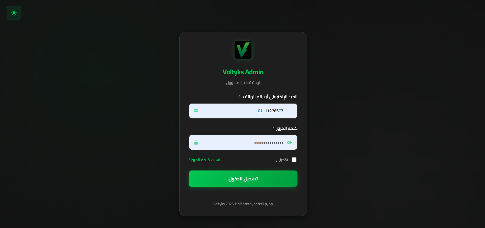 |

### 📊 Dashboard
| Main Dashboard |
|:---:|
| 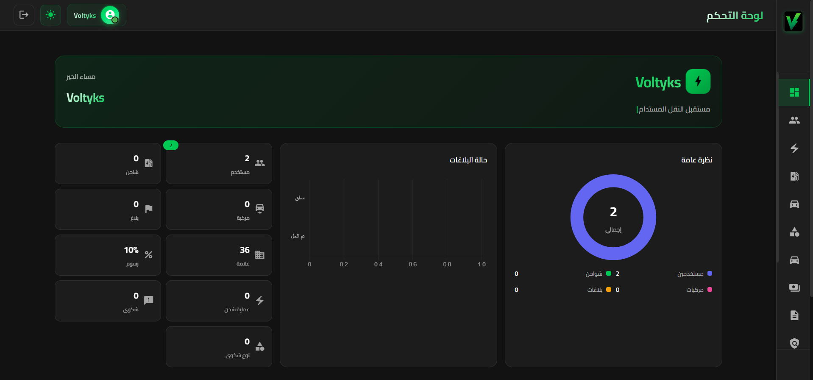 |

### 👥 User Management
| Users List |
|:---:|
| 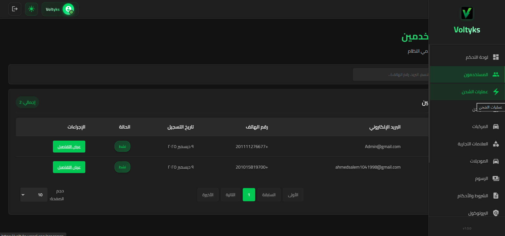 |

### ⚡ Charging Operations
| Processes |
|:---:|
| 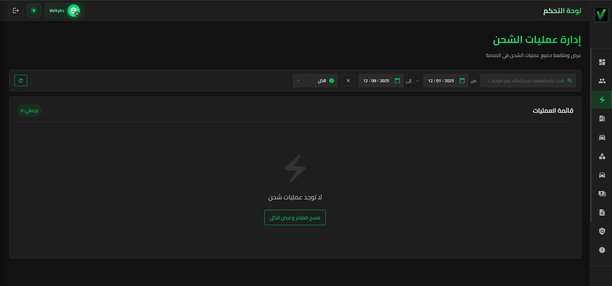 |

### 🔌 Chargers & Vehicles
| Chargers | Vehicles |
|:---:|:---:|
| 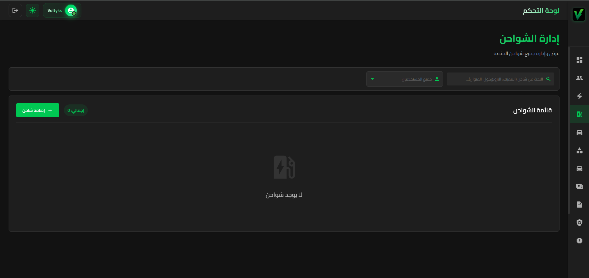 | 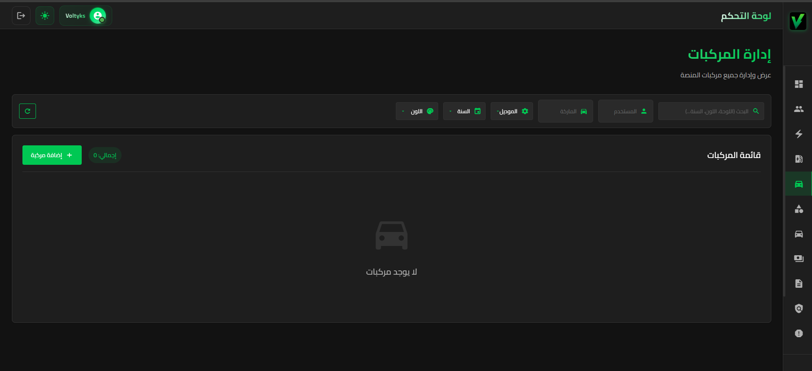 |

### 🏷️ Brands & Models
| Brands | Models |
|:---:|:---:|
| 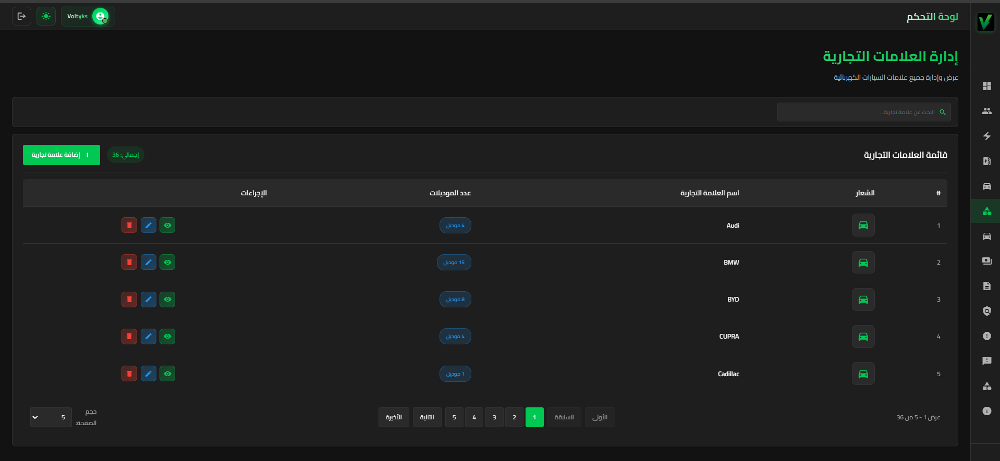 | 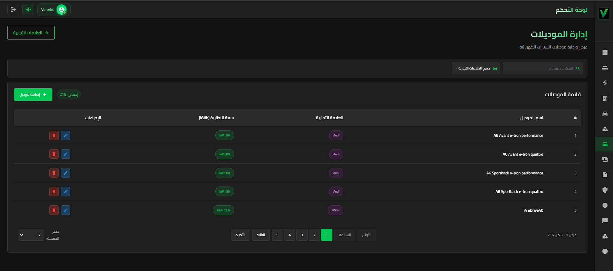 |

### 💰 Fees Management
| Fees Configuration |
|:---:|
| 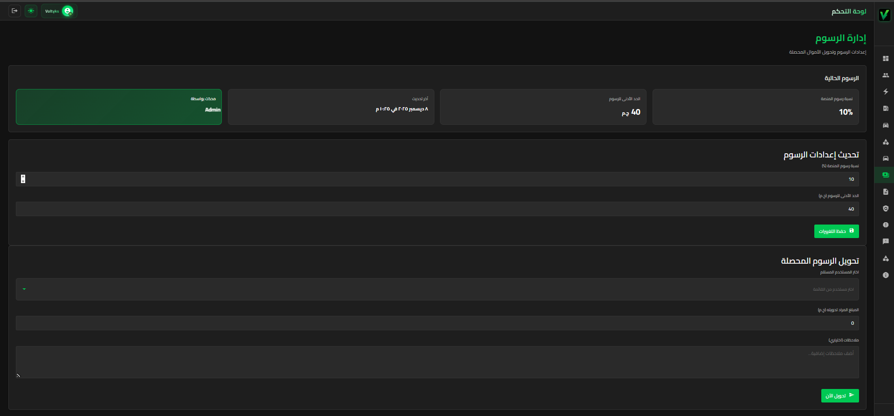 |

### 📋 Terms & Conditions
| Terms View | Terms Edit (JSON) |
|:---:|:---:|
| 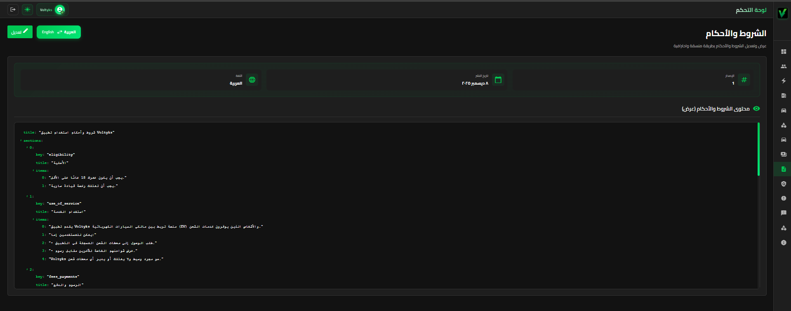 | 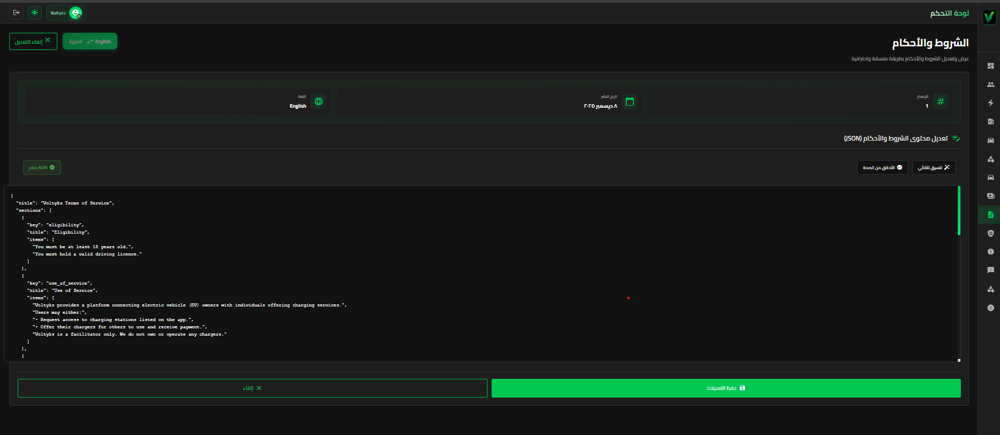 |

### 🔧 Protocols
| EU Protocol | CN Protocol |
|:---:|:---:|
| 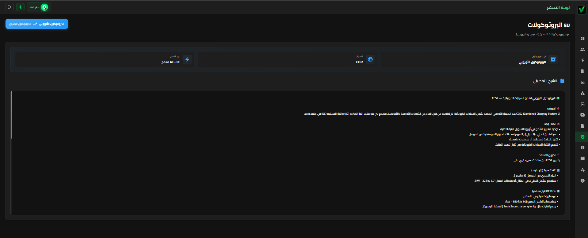 | 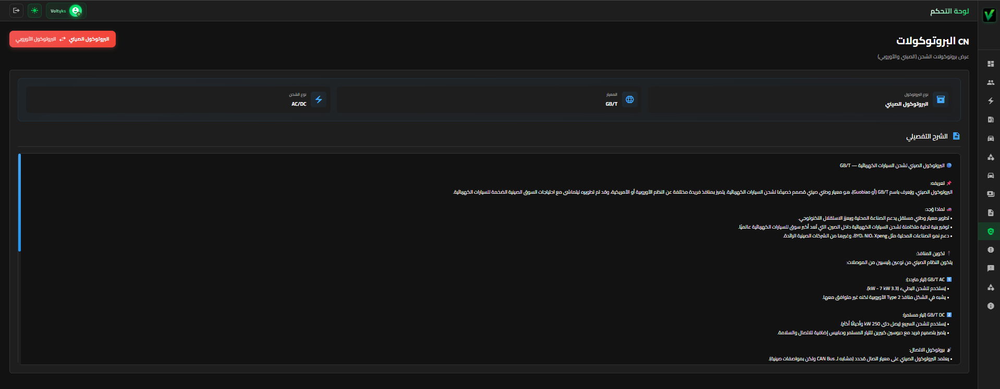 |

### 📈 Reports
| Reports Management |
|:---:|
| 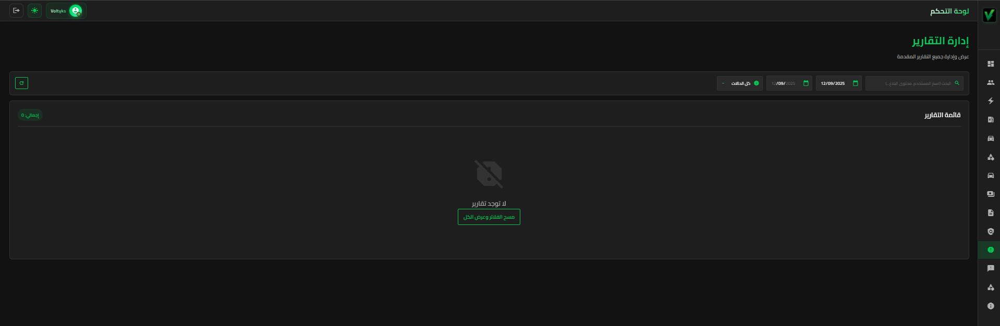 |

### 📢 Complaints
| Complaints List | Complaint Categories |
|:---:|:---:|
| 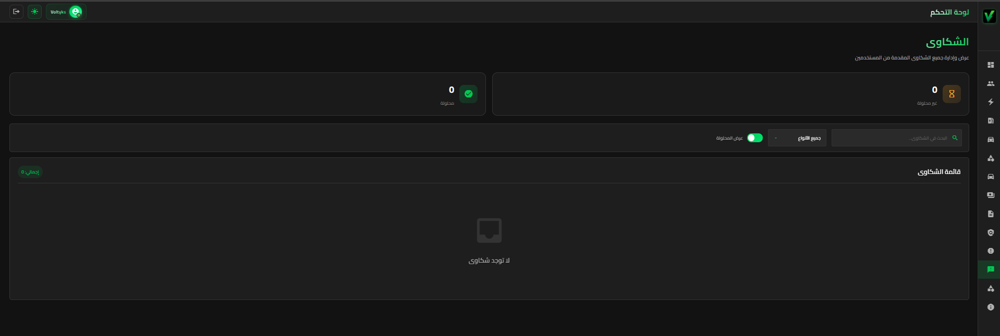 | 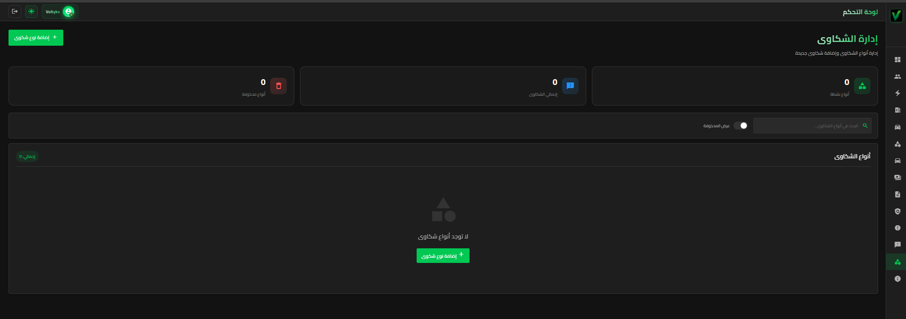 |

### ℹ️ About Page
| About Voltyks |
|:---:|
| 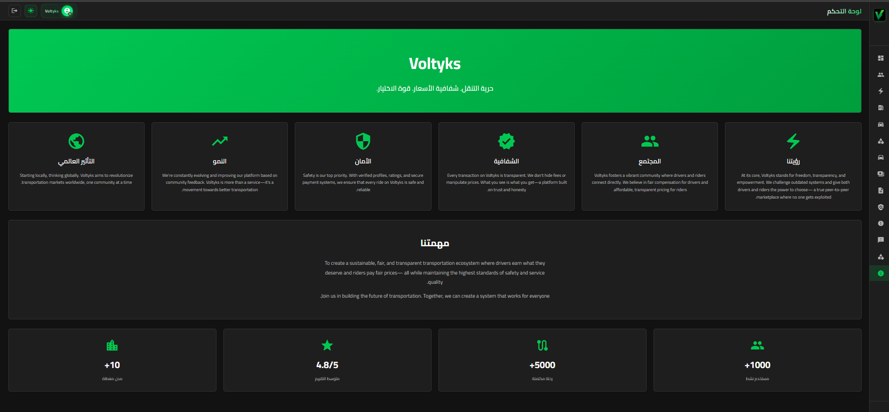 |

</details>

---

<!-- Browser Support -->
## 🌐 Browser Support

<div align="center">

|  |  |  |  |
|:---:|:---:|:---:|:---:|
| Chrome | Firefox | Safari | Edge |
| ✅ Latest | ✅ Latest | ✅ Latest | ✅ Latest |

</div>

---

<!-- API Section -->
## 🔌 API Integration

<details>
<summary><b>📡 Click to expand API Endpoints</b></summary>

```
🔹 /api/admin/
├── 👥 users                  # User management
├── 🔌 chargers               # Charger operations
├── 🚗 vehicles               # Vehicle management
├── 🏷️ brands                 # Brand management
├── 💰 fees                   # Fee configuration
├── 📄 terms                  # Terms & Conditions
├── 📋 protocol               # Protocol content
├── 📊 reports                # Report generation
├── 💳 process                # Transactions
├── 📢 complaints             # Complaints
└── 📁 complaint-categories   # Complaint types

🔹 /api/auth/
├── 🔐 login                  # Authentication
├── 🔑 forgot-password        # Password recovery
└── 📝 general-complaints     # User complaints
```

</details>

---

<!-- Footer -->
<div align="center">


### 💙 Made with passion by the Voltyks Team

<p>
  
  
  
</p>


**⭐ Star this repo if you find it helpful!**

</div>
